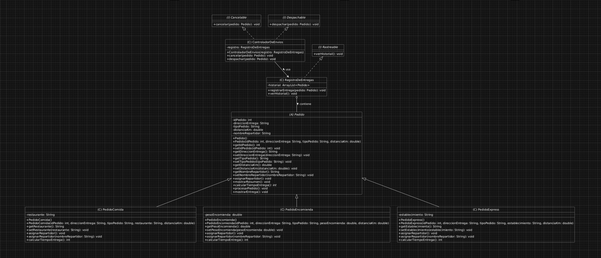

# 💻 Diseñando un sistema orientado a objetos con clases abstractas, polimorfismo e interfaces - Semana 3 - Desarrollo Orientado a Objetos II

---

## 👤 Autor del proyecto
- **Carrera:** Analista Programador.
- **Asignatura:** Desarrollo Orientado a Objetos II (005A).
- **Sede:** Online.
- **Profesor:** Eithel González Rojas.
- **Nombre completo:** Jaime Seguel Retamales.

---

## 📘 Descripción general del sistema
Proyecto de la Semana 3 de Desarrollo Orientado a Objetos II. Integra la jerarquía de **Pedido** (polimorfismo y clase abstracta de las semanas anteriores) con 3 interfaces nuevas: **Despachable**, **Cancelable** y **Rastreable**. Las interfaces se reparten entre 2 clases de servicio: **ControladorDeEnvios** (despacho y cancelación) y **RegistroDeEntregas** (historial, guardado en un `ArrayList<Pedido>`), separando responsabilidades en vez de concentrarlas en una sola clase.

---

## 🧩 Diagrama de clases

**Aporte a escalabilidad, reutilización y mantenibilidad:**
- **Reutilización:** los atributos y métodos comunes a todo pedido (`idPedido`, `direccionEntrega`, `distanciaKm`, `mostrarResumen()`, `procesarPedido()`) viven una sola vez en `Pedido`, y las 3 subclases los heredan sin duplicar código.
- **Escalabilidad:** agregar un nuevo tipo de pedido, o una nueva interfaz, no obliga a modificar las clases existentes — solo a extenderlas, gracias a la jerarquía abstracta y al uso de interfaces.
- **Mantenibilidad:** al repartir `Despachable`, `Cancelable` y `Rastreable` entre `ControladorDeEnvios` y `RegistroDeEntregas` (en vez de una sola clase con las 3), cada una mantiene una única responsabilidad, lo que facilita encontrar y corregir errores sin afectar al resto del sistema.

---

## ⚙️ Instrucciones para clonar y ejecutar el proyecto

**1.** **Clona el repositorio desde GitHub:**
[https://github.com/jamesAnimal/SpeedFast.git](https://github.com/jamesAnimal/SpeedFast.git)

**2.** **Abre el proyecto en IntelliJ IDEA.**

**3.** **Ejecuta el archivo `Main.java`** dentro del paquete `speedfast`.

---

**Repositorio GitHub:** [https://github.com/jamesAnimal/SpeedFast](https://github.com/jamesAnimal/SpeedFast)

---

© Duoc UC | Escuela de Informática y Telecomunicaciones | Desarrollo Orientado a Objetos II | Semana 3.
